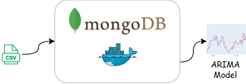

# Air Quality Forecasting – Morocco (PM2.5 Prediction)
This project was developed as part of the WQ Labs – Air Quality (030) course, where we built a time series forecasting model to predict PM2.5 levels throughout the day.This implementation uses Morocco air quality data from https://explore.openaq.org/ site, with a full data pipeline built using MongoDB and Docker.

## Pipeline
Data Source → MongoDB (Docker) → Data Cleaning → ARIMA Model
          → Walk‑Forward Validation → Forecasting App → Performance Monitoring

